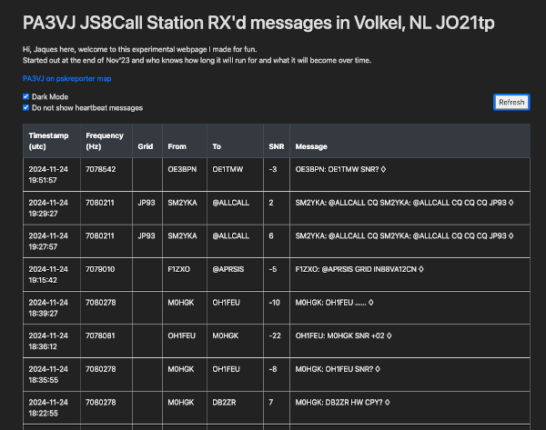

## Preamble
I enjoy HAM radio a lot and the JS8 modulation scheme just makes sense.
Able to get CW type distances on a digital mode that implents FEC?
Wow is all I can say.

Anyhow, I set up my HF rig in the Netherlands at our first rental home and was so happy to hear so much traffic on air.
But digging through the JS8Call application interface to see which new stations are around and what the HAMs chatted about was a pain.

So I heard about the JS8Net parser below and decided to push what was heard to a DB and pull some of that info to a simple webpage just to have a quick look once or twice a day who is chatting.  
______

### Mega thanks
To **jfrancis42** for his work in js8net parser as found at [jfrancis42/js8net](https://github.com/jfrancis42/js8net)\

### Modules' description

**js8_get_msgs** is the part that'll connect to your [JS8Call](http://js8call.com/) app's TCP port and log msgs to the dB\
**the dB** - I use a MariaDB instance, the `CREATE` statements are [here](js8_get_msgs/README1st_get_msgs.MD)\
**js8_web** is the python flask webserver that'll query the dB and display the info for you\

  
_View of what the **js8_web** web page looks like_  

  
_from the JS8Call webpage_
